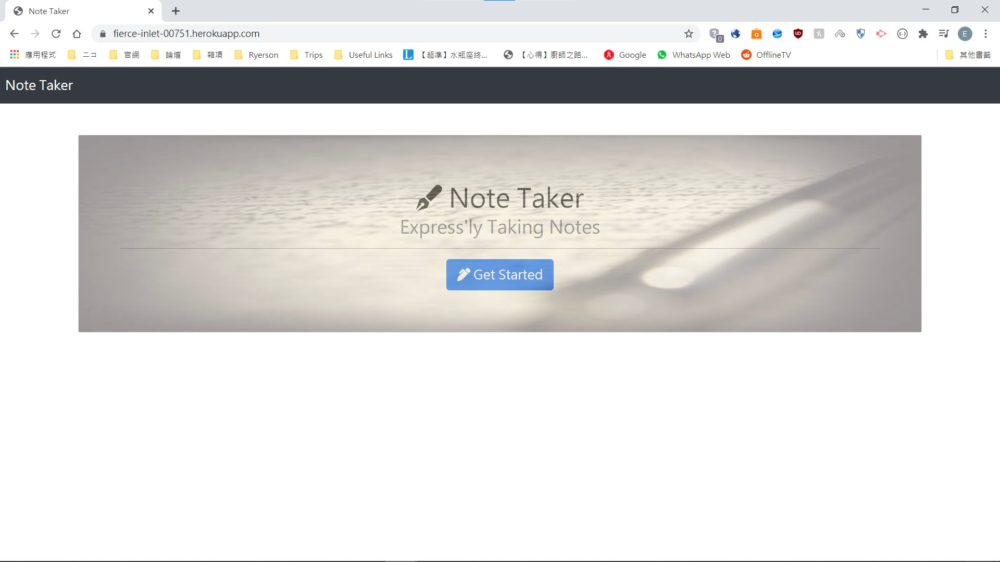
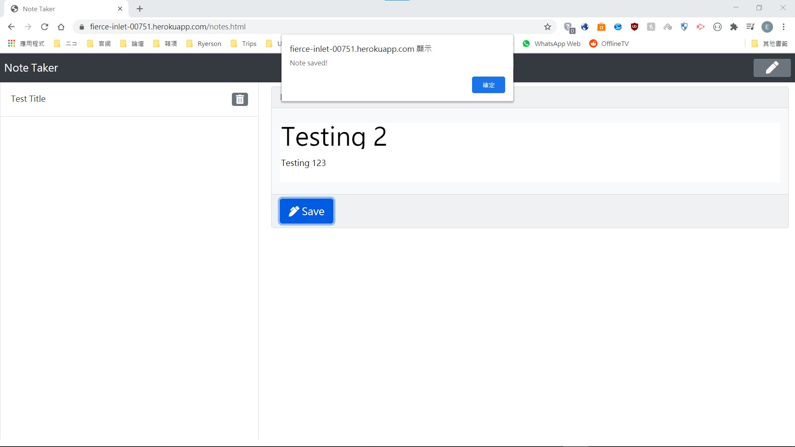
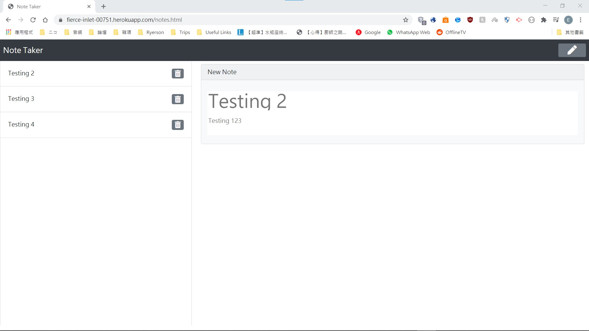
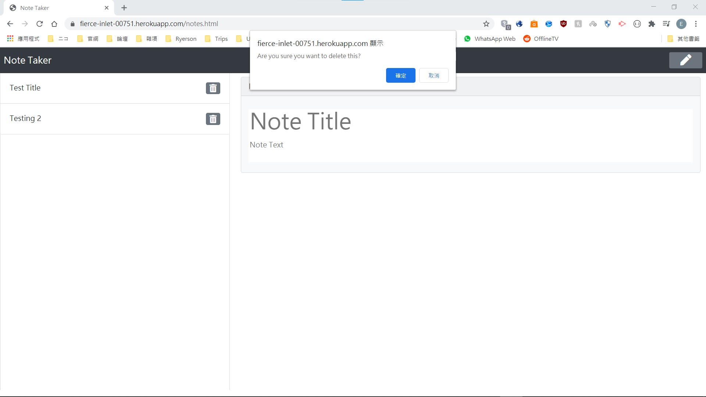
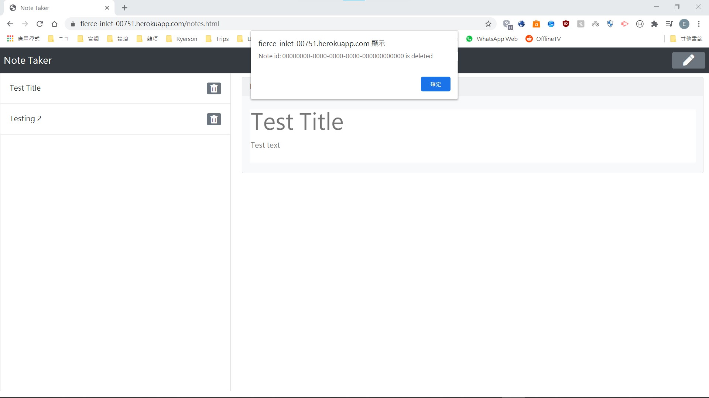
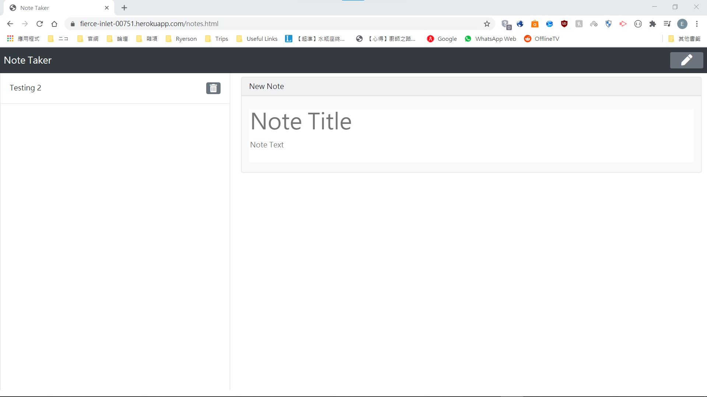

# Note-Taker
Goal: To create a webapp for taking notes and review those notes with API calls 
This project has the following abilities:
- Create new notes and store them when "Saved" button is pressed
- Display corresponding note when one of the notes in the sidebar is clicked
- Delete corresponding note when the delete button is clicked
- Able to retain notes when the page is reloaded
- Each note has an unique id created using **uuid npm package**

 

This project contains the following files:
- index.html, notes.html: General page layout written in **HTML5**
- server.js: Server with endpoints written in **express.js**
- script.js: Page manager for *notes.html*, which handles API calls to server.js and displays corresponding contents
- db.json: The database file, where all the notes are saved to
- style.css: General styling for index.html and notes.html
- package.json: Contains npm information and packages used in this project

 

This project was made using: **HTML5**,  **CSS**, **Bootstrap**, **JavaScript**, **jQuery**, **NodeJS**, **express.js**, **uuid npm package**  
This project is currently hosted on Heroku: https://fierce-inlet-00751.herokuapp.com/  

## index.html
- The landing page

## notes.html
- **CAUTION**: Old notes *CANNOT* be edited at this moment
- *Create new note* button: Top left corner
- *Save* button: Will appear once the user has entered some content in the *New Note* card
- *Delete* button: Right side of the note title in the left sidebar

### Saving new notes

### Deleting notes

